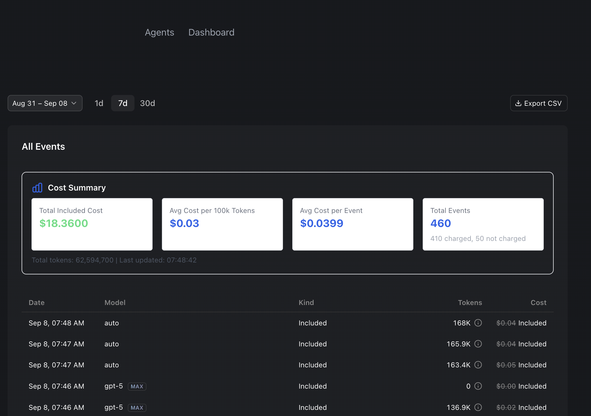

# Cursor Cost Analysis Summary User Script

This user script enhances the Cursor dashboard by adding a custom "Cost Summary" section below the "All Events" heading. It provides a quick overview of your usage, including total included cost, average cost per 100k tokens, average cost per event, and a breakdown of charged vs. non-charged events.

## Features

- **Dynamic Summary**: Calculates and displays key cost metrics automatically
- **Pagination Handling**: Automatically sets the table to display the maximum number of rows (500, 250, or 100) to ensure comprehensive data collection
- **Real-time Updates**: The summary updates when table data changes (e.g., after pagination or filtering)
- **Clear Event Counts**: Shows total events and a breakdown of charged vs. not charged events
- **Responsive Design**: Works with both light and dark themes

## Metrics Displayed

- **Total Included Cost**: The sum of all charged events (displayed in green)
- **Avg Cost per 100k Tokens**: The average cost for every 100,000 tokens used in charged events (displayed in blue)
- **Avg Cost per Event**: The average cost per event across all charged events (displayed in blue)
- **Total Events**: The total number of events, with a sub-breakdown of how many were charged and how many were not charged (displayed in blue)

## Installation Guide (Recommended: Tampermonkey)

To use this script, you'll need a browser extension that can manage user scripts. We recommend **Tampermonkey** as it's the most popular and reliable option.

### Step 1: Install Tampermonkey

If you don't already have it, install the Tampermonkey browser extension:

- **Chrome**: [Tampermonkey for Chrome](https://chrome.google.com/webstore/detail/tampermonkey/dhdgffkkebhmkfjojejmpbldmpobfkfo)
- **Firefox**: [Tampermonkey for Firefox](https://addons.mozilla.org/en-US/firefox/addon/tampermonkey/)
- **Edge**: [Tampermonkey for Edge](https://microsoftedge.microsoft.com/addons/detail/tampermonkey/iikmkjmpbldmmepgdkmfapfmghfpccnj)
- **Opera**: [Tampermonkey for Opera](https://addons.opera.com/en/extensions/details/tampermonkey-beta/)

### Step 1.5: Enable Developer Mode (Required)

> For more detailed information, see the [official Tampermonkey FAQ](https://www.tampermonkey.net/faq.php#Q209).

**Important**: Before installing userscripts, you must enable Developer Mode in Tampermonkey:

1. Click on the Tampermonkey icon in your browser toolbar
2. Select "Dashboard" to open the Tampermonkey management page
3. Go to the "Settings" tab
4. Set "Config mode" to "Advanced" or "Beginner" to see all options
5. Look for "Developer mode" and enable it
6. Click "Save" to apply the changes

This is **essential** for installing userscripts manually. Without Developer Mode enabled, Tampermonkey may not properly recognize or run your scripts.

### Step 2: Create a New User Script

1. Click on the Tampermonkey icon in your browser's toolbar
2. Select "Create a new script..." (or "Dashboard" and then the "+" icon)
3. This will open a new tab with a basic script template

### Step 3: Copy the Script Content

1. Open the `cursor-cost-summary.user.js` file
2. Copy the **entire content** of the `cursor-cost-summary.user.js` file

### Step 4: Paste and Save the Script

1. Go back to the Tampermonkey editor tab
2. **Delete** all the existing boilerplate code in the editor
3. **Paste** the copied content of `cursor-cost-summary.user.js` into the empty editor
4. Save the script by clicking "File" > "Save" (or pressing `Ctrl+S` / `Cmd+S`)

### Step 5: Verify Installation

1. Navigate to the Cursor dashboard: `https://cursor.com/dashboard?tab=usage`
2. The "Cost Summary" section should now appear below the "All Events" heading and above the table
3. If you don't see it, try refreshing the page
4. You can also open your browser's developer console (`F12`) and check the "Console" tab for any `[Script]` logs or errors

## How It Works

The script automatically:

1. **Waits for the table to load** - Ensures all data is available before calculations
2. **Sets maximum pagination** - Attempts to show all events (up to 500 rows) for accurate calculations
3. **Extracts data** - Parses token counts, costs, and event types from the table
4. **Calculates metrics** - Computes totals, averages, and breakdowns
5. **Displays summary** - Inserts a formatted summary card below "All Events"
6. **Updates dynamically** - Recalculates when the table changes

## Troubleshooting

### Script Not Running
- Ensure Tampermonkey is enabled and the script is active
- Check that you're on the correct URL: `https://cursor.com/dashboard?tab=usage`
- Try refreshing the page

### Summary Not Appearing
- Open browser console (`F12`) and look for `[Script]` logs
- Check for any JavaScript errors
- Ensure the "All Events" section is visible on the page

### Incorrect Calculations
- The script uses only visible table data
- If you have more than 500 events, some may not be included in calculations
- Try changing the pagination settings manually if needed

## Technical Details

- **Target URL**: `https://cursor.com/dashboard*`
- **Dependencies**: None (pure JavaScript)
- **Browser Support**: Chrome, Firefox, Edge, Opera (via Tampermonkey)
- **Update Frequency**: Real-time when table data changes

## Contributing

Feel free to submit issues or pull requests to improve the script. Common improvements might include:

- Additional metrics
- Better error handling
- Support for different Cursor dashboard layouts
- Export functionality

## License

This script is provided as-is for educational and personal use. Please respect Cursor's terms of service when using this tool.

---

**Note**: This is an unofficial script and is not affiliated with Cursor or its developers. Use at your own discretion.
